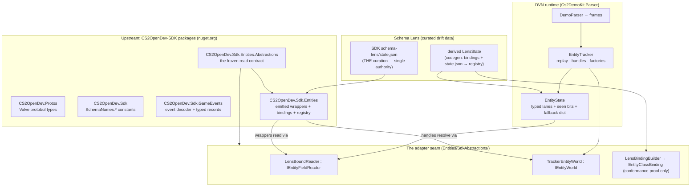
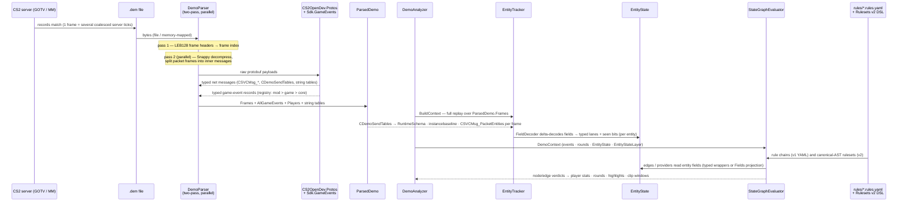
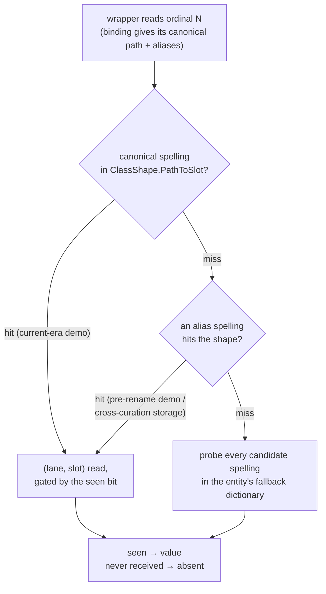
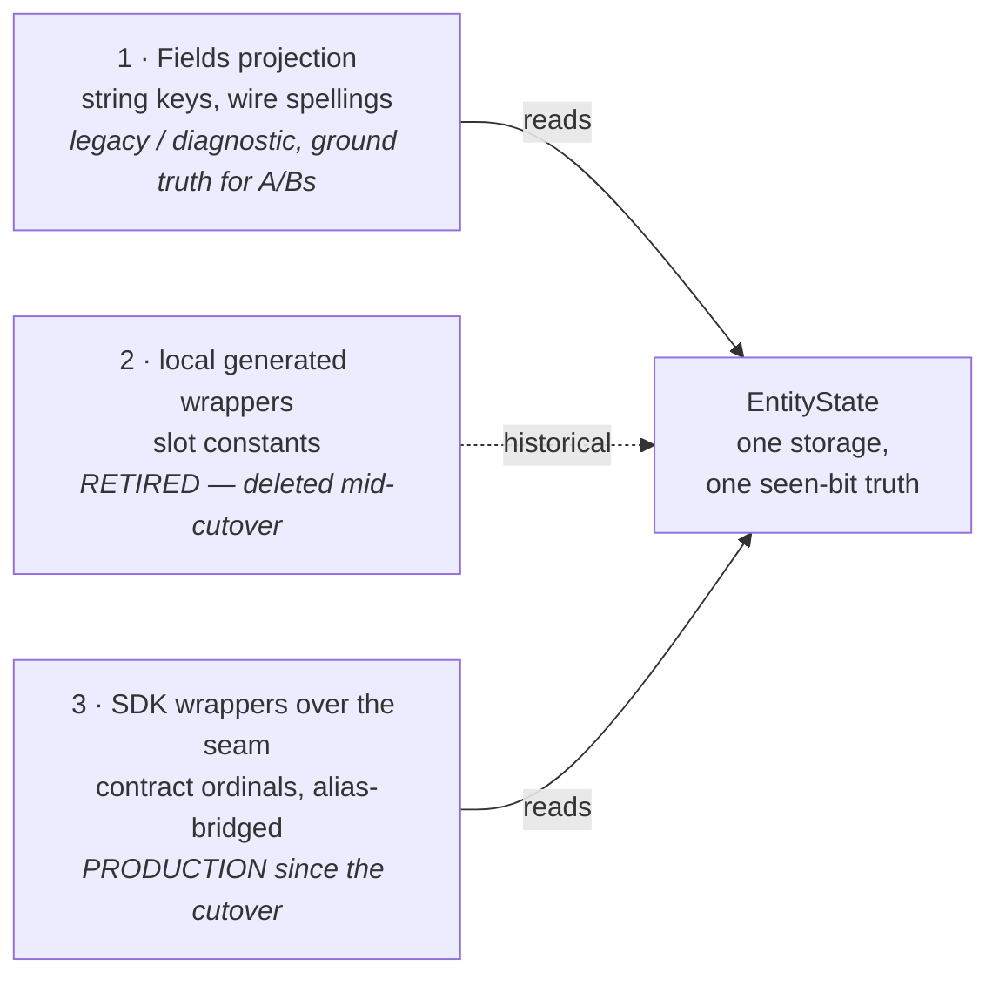

# The CS2 entity stack — SDK packages, Schema Lens, and the adapter seam

Written 2026-08-14 as the CS2OpenDev adoption wrapped up; updated 2026-08-15 after the cutover
completed. The SDK packages are adopted end-to-end and the `CS2OpenDev.Sdk.Entities` wrappers are
production — the local generated wrapper layer described in §7 below is deleted, and that section
is kept in past tense as the record of the lever that got us here. Later the same day the local
Schema Lens migration JSONs were retired too: the lens registry is now derived from the pinned SDK
package (`tools/DemoViewer.NET.Codegen/SchemaLensSdkDeriver.cs`), and §4's "two Lens states"
description was updated to match (single curation authority upstream; parity proven 162/162, then
extended to the full 735-path curation, golden-verified value-identical). Companion documents:
`docs/upstream/sdk6-adapter-findings.md` (the seam-contract findings) and the running ledger
`docs/upstream/cs2opendev-sdk-consolidated-requests.md`. The delivered correspondence — the
SDK#6 entity-abstraction proposal, the emitter-seed handoff, the SDK#25 stage-2/3 verification
reports, the cutover-readiness inventory — was retired to git history 2026-08-16.

## 1. Why the stack has this shape

DemoViewer.NET used to own every layer between demo bytes and a typed `pawn.Health` read:
protoc-generated protobufs, a hand-rolled game-event decoder, 272 generated event records, a
curated schema-drift layer (Schema Lens), and 118 generated entity wrapper files. Through
2026-08 the direction was to replace everything replaceable with the CS2OpenDev-SDK family
and push every gap upstream rather than patch it locally.

The one layer that could not simply be replaced was entity wrappers, because typed wrappers
must read fields *from something*, and the SDK deliberately has no entity runtime — it never
parses a demo. The resolution, negotiated on SDK#6, is a **frozen read contract** between
wrapper code and entity runtimes: the SDK emits wrappers against the contract; any runtime
(ours, or anyone's) implements the contract over its own storage. DVN wrote the contract's
second implementation, which is what proved the seam and took the contract to its 1.0
criterion.

The result is four layers with sharp boundaries:

## 2. Life of a demo — from GOTV bytes to a rule verdict

The end-to-end path, showing where each upstream package does its work and where the layers
hand off. Two phases matter: **parse** (bytes → `ParsedDemo`, no entity state yet) and
**analyze** (`ParsedDemo` → entity replay → rule evaluation). One load-bearing clock fact
rides along the whole way: a GOTV *frame* coalesces multiple server *ticks*, and
`RuleChainEvent.Tick` / `GameEvent.GameTick` are already frame-clock — only the absolute
`GameEvent.ServerTick` ever converts (see `docs/csvg-integration/implementation-plan.md`).

Notes on the hand-offs:

- **The parser never holds entity state.** `ParsedDemo` carries decoded frames and events;
  entity decode happens later, on demand, when `DemoAnalyzer.BuildContext` replays the
  tracker (or `BuildEventContext` skips it for event-only work).
- **Both decode steps are package-typed.** Net messages materialize as `CS2OpenSchema.Protos`
  types; game events materialize as `CS2OpenSchema.Events` records through the
  `Sdk.GameEvents` registry. Nothing in DVN defines a wire message or event shape anymore.
- **The evaluator reads entity data two ways**: enrichment edges and providers
  (`Plugins/`, `Edges/`) read through the SDK wrappers over the adapter seam
  (`SdkEntityWorlds`), and rule expressions reach `player.entity.*` fields through the same
  underlying state. The storage layout underneath is unchanged from before the cutover.

## 3. Layer 1 — the upstream packages

All five come from nuget.org, versions pinned centrally in `Directory.Packages.props`. They were
vendored as committed `.nupkg` files until the family reached nuget.org in 2026-08. Four of the
five now arrive transitively through the CS2DemoKit packages; only `CS2OpenDev.Sdk` is referenced
directly here, for its `SchemaNames.*` constants.

| Package | Provides | Consumed by | Version clock |
|---|---|---|---|
| `CS2OpenDev.Protos` | Prebuilt Valve protobuf message types (`CS2OpenSchema.Protos`); replaced our local protoc pipeline entirely | Parser (7 public members expose these types), App payload views | Own `version.json` scoped to `protos/`; a semver gate fails any release whose proto surface shrinks without a major |
| `CS2OpenDev.Sdk` | `SchemaNames.*` — a flat table of schema name constants | Analysis + App (name lookups only; we reference **zero** generated schema classes) | Family clock: regenerates ~4-hourly against the current CS2 build |
| `CS2OpenDev.Sdk.GameEvents` | Game-event decoder, registry (mod > game > core precedence), typed event records (`CS2OpenSchema.Events`) | Parser event pipeline; replaced our hand-rolled decoder + 272 generated records + the supplementary layer (all deleted) | Family clock |
| `CS2OpenDev.Sdk.Entities.Abstractions` | **The frozen read contract** (§6): `IEntityFieldReader`, `IEntityWorld`, `EntityWrapper`, `EntityClassBinding`, `QAngle`, `SchemaFieldVersionAttribute`, plus `DictionaryEntityReader` (reference implementation / conformance kit) and `BindingConformance` (manifest validator). BCL-only, trimmable, AOT-clean | The adapter seam; both wrapper generations eventually | **Its own human clock** — `version.json` pathFilters cover only its directory, so a schema regen cannot move it. This is deliberate: a contract on a 4-hourly clock is not frozen |
| `CS2OpenDev.Sdk.Entities` | The emitted wrappers: `sealed` classes deriving `EntityWrapper` with their `EntityClassBinding` manifests and the generated `EntityWrapperRegistry` (`Create(engineClass, reader, world)` switch + `LensHash`/`SchemaBuild` constants) — 61 curated classes / 735 canonical paths as of 1.1.0 | Production reads via `SdkEntityWorlds` (Analysis) since the cutover; the lens registry is derived from this package's bindings | Regenerates with the schema (it is a projection of `state.json`), referencing the frozen contract |

## 4. Layer 2 — Schema Lens, and the fact that there are two of them

Schema Lens is the curated drift layer: for each covered class, the **canonical** field paths,
historical spelling **aliases**, the stable .NET `targetProperty`/`netName` names, and enough
type metadata to emit read code. It exists because raw schema dumps churn with every CS2 build
while consumers need stable names and rename survival.

Since 2026-08-15 there is one curation and one derived artifact:

- **Upstream (the authority):** `schema-lens/state.json` in the CS2OpenDev-SDK repo — seeded
  from our V1.1 spec, then owned and evolved by them (module pins, `observedFields`,
  staleness gates `CS2_GEN_010/011/012`, rename curation over SchemaTracker candidate
  evidence). This is what the `Sdk.Entities` emitter reads, and — together with the emitted
  bindings — what our codegen derives the lens from. Schema-drift history lives in their
  migration files.
- **Local (derived):** `GeneratedLensRegistry` in `Entities/Generated/SchemaLens.Generated.cs`,
  emitted by `SchemaLensSdkDeriver` (package bindings for classes/paths/aliases + `state.json`
  for per-canonical `schemaType`), canonical-form hash `canon-v1` recomputed by the test suite
  to catch emit drift. What stays DVN-owned is code, not data: the
  `schemaType → (lane, transform)` storage-policy mapping (honest honour-the-wire lanes), and an
  interim wire-flattening alias for the origin cell leaves
  ([SDK#44](https://github.com/CS2OpenDev/CS2OpenDev-SDK/issues/44), embed + aliases asks).
  The migration JSONs, replay, and loader machinery are deleted — parity was proven before
  the switch (162/162 rules identical through the derived AliasMap) and the derivation
  extends coverage to the full curation (735 rules / 61 concrete classes, so formerly
  dict-only fields like weapon `Clip1` now lane-bind), golden-verified value-identical.

**The spelling split is now wire-vs-canonical, not rule-vs-rule.** The SDK's canonicals are
schema-true (origin relocated to `m_CBodyComponent.m_pSceneNode.m_vecOrigin`); the wire still
presents `m_vecOrigin` and the flat cell spellings, bridged by the alias tables at bind time.
Rules that keep this safe:

1. **Ordinals are meaningful only within one (binding, wrapper) pair.** An SDK-emitted
   binding and a locally-built binding assign different ordinals to the same field. Never
   compare ordinal-to-ordinal across the two states.
2. **Cross-state joins go by canonical path, through the alias table.** This is how the
   stage-3 A/B verification works and how any future cross-check must work.
3. **The two Lens hashes are never comparable.** Ours (`canon-v1`) hashes lane/transform/
   fallback fields their state does not have; theirs (`lens-canon-1`) hashes their shape.
   Each side asserts only its own. The registry's `LensHash` doc-comment says exactly this
   (it briefly said the opposite in `Sdk.Entities` 0.1.0 — our report caught it; fixed in 0.1.1).

## 5. Layer 3 — the DVN runtime the contract is implemented over

Nothing in the upstream stack stores or decodes anything. That is this layer, unchanged by
the whole adoption:

- **`EntityState`** (`EntityTracking/`): per-entity storage in three typed lanes
  (`int[]`/`float[]`/`object?[]`) plus a fallback dictionary, with per-lane `_seen[]`
  bitvectors. Seen-awareness is what makes the contract's central semantic (absent ≠
  received-default) implementable at all. Storage is **wire-keyed** — the string-keyed
  `Fields` projection reproduces the demo's own spellings for legacy consumers.
- **`ClassShape`**: per-class `PathToSlot` map (wire spelling → lane/slot), built from the
  local Lens state; immutable, shared across all states of a class.
- **`EntityTracker`**: stateful replay (`AdvanceToIndex`), the **factory registry** (one
  factory per engine class — the cutover lever, see §7), and handle resolution. The tracker
  owns the `& 0x3FFF` mask and the `0`/`0xFFFFFFFF` sentinel checks. Per SchemaTracker#11's
  verified negative, the index/serial bit split is not extractable from the binaries; the
  hl2sdk reconciliation (our 14 bits matches the *networked* handle encoding
  `NUM_NETWORKED_EHANDLE_BITS = 14 + 10`; the SDK's retracted 15 described the in-memory
  entry width) is recorded as hypothesis, not fact — which is exactly why **generated code
  never decodes a handle** anywhere in this stack.

## 6. Layer 4 — the adapter seam (`Entities/SdkAbstractions/`)

Three small classes are the entire shim between the SDK's world and ours — the minimal
shims the whole adoption was meant to converge on:

- **`LensBoundReader : IEntityFieldReader`** — reads one entity's fields by contract ordinal.
  Its translation table (`LensOrdinalMap`, cached per `ClassShape`) resolves each ordinal
  through a **candidate list**: the binding's canonical path first, then every alias spelling
  the binding targets at it, against the wire-keyed shape — falling back to dictionary
  probing for unmapped paths. This candidate walk is the **alias bridge**: it is what lets an
  SDK-emitted wrapper (canonical `m_CBodyComponent.m_pSceneNode.m_vecOrigin`) read our
  storage (keyed `m_vecOrigin`) without either side knowing about the other. The constructor
  accepts **any** `EntityClassBinding` — package-emitted or locally built — which is the
  property the stage-2/3 verification confirmed ("zero adapter changes needed").
- **`TrackerEntityWorld : IEntityWorld`** — `Resolve<T>(uint) where T : EntityWrapper`,
  one line over the tracker's existing resolution. Mask and sentinel policy stay the
  runtime's; the adapter re-implements nothing.
- **`LensBindingBuilder`** — builds `EntityClassBinding` manifests at runtime from the
  **local** `LensState` (ordinal-sorted canonical paths, non-identity aliases, handle
  ordinals). Used for running local wrappers-of-the-future and the conformance suite over
  our own curation; **not** used when consuming SDK-emitted wrappers, which carry their own
  manifests (`EntityWrapperRegistry.Bindings`).

How one ordinal read resolves — the alias bridge as a decision walk:

The contract semantics the seam guarantees (pinned by the 43-test conformance port in
`Cs2DemoKit.Parser.Tests/SdkAbstractions/`):

| Situation | Contract behaviour |
|---|---|
| Field never received | Every `TryRead*` returns `false` ("absent") |
| Received zero/default | `true` + the value — `m_lifeState = 0` means LIFE_ALIVE, not "no data" |
| Received null (object-lane only) | `TryReadObject` → `true` + `null`; typed readers → `false` |
| Handle field | Raw packed `uint` via unchecked width-fold — no mask, no split, and the `0xFFFFFFFF` invalid sentinel **must** be able to cross (our F3 argument, adopted upstream in Abstractions 0.2.1) |
| Out-of-range ordinal | Absent, never a throw — stale wrappers degrade instead of crashing |
| Vector3 vs QAngle cross-reads | Implementation-defined (our storage boxes both as `Vector3`); discrimination is the emitter's job — each generated property calls the accessor matching its schema type |

## 7. The two wrapper generations, and the cutover lever (historical — the cutover completed)

Until 2026-08-14 two generations of typed wrappers coexisted:

| | Local generated (`Entities/Generated/`, 118 files) — deleted | SDK-emitted (`CS2OpenDev.Sdk.Entities`) — production |
|---|---|---|
| Read via | Storage lanes directly (`GetIntSlot(...)` + codegen slot constants) | Contract ordinals through `LensBoundReader` (lane-backed for lens-curated fields) |
| Curation source | Local Lens migrations | SDK `state.json` |
| Base type | Local `EntityBase` (deleted) | Contract `EntityWrapper`, with schema-true inheritance since 1.x |
| End state | Deleted in the second stage of the cutover (−4,040 lines) | Production via `SdkEntityWorlds` (Analysis) since the first stage; verified by the standing battery (~30k real-demo ordinal comparisons, 0 mismatches, three byte-identical golden rounds) |
| Emitted by | Retired `--schemalens-slots`/`--schemalens-wrappers` generators (deleted; flags fail loudly) | The SDK's emitter (seeded from ours — the retired emitter-seed handoff, git history) |

The migration lever that made it safe: `EntityTracker`'s registry holds **one factory per
engine class, and registering replaces**, so the cutover ran class-by-class with both
generations coexisting and every stage proven by golden A/B before the next. `EntityState`,
`ClassShape`, and the `--schemalens` registry emit all stay — they are storage, not emit
(the migration loader that fed the emit was itself retired later on 2026-08-15, when the
registry became derived from the SDK package).

The blockers the original text listed here (flat wrapper hierarchy nulling the weapon-typed
companions; the missing `m_hPlayerPawn` companion) were both fixed upstream during the
adoption arc (SDK#29/#30/#41). Still-true permanent context:
`m_vecOrigin` is a **phantom on GOTV demos** — positions arrive as cell components and are
reconstructed via `PositionUtil.CellToWorld`, so the SDK wrapper's `Origin` legitimately
reads `(0,0,0)` on real data; position consumers keep the cell path regardless of wrapper
generation.

## 8. The three read paths, side by side

All three read the same `EntityState`; they differ only in addressing. Presence semantics
are identical everywhere because all three sit on the same `_seen[]` bits.

## 9. What pins what — the verification map

| Battery | Location | Pins |
|---|---|---|
| Conformance port (43 tests) | `SdkAbstractions/LensBoundReaderContractTests` + `LensBindingBuilderConformanceTests` + `SdkWrapperCompositionTests` + `SdkAdapterDemoSmokeTests` | Our adapters against the contract's semantics (the suite that took Abstractions to its 1.0 criterion) |
| Stage-2/3 battery (13 tests) | `SdkAbstractions/EmittedWrappersStage2Tests` + `EmittedWrappersStage3Tests` | The SDK-emitted package over our runtime: census, prefix-layout law, registry, alias bridge, inheritance seams, real-demo A/B by canonical path |
| `BindingConformance.ThrowIfInvalid` | Inside both batteries | Structural manifest invariants, over both binding sources |
| Golden A/B (`AnalysisBench --suite` + normalized diff) | `tests/fixtures/` | Value-neutrality of every adoption/cutover phase end-to-end |
| Upstream's own suite (34 tests) | CS2OpenDev-SDK `test/…Abstractions.Tests/` | The contract against the reference reader; their CI |

Both local batteries run in the ordinary Parser suite (baseline 279/0), so every future pin
bump re-verifies the whole seam for free.

## 10. Standing rules (each one earned)

- **Handles cross every seam raw.** Decoding (mask, serial, sentinel) happens in exactly one
  place: the runtime's resolver. Twice now, documentation claiming otherwise was the bug.
- **Join across curations by canonical path, never ordinal; never cross-compare Lens hashes.**
- **Absent is not zero.** Any new read surface must preserve the seen-asymmetry; a runtime
  without per-field seen-tracking cannot implement the contract honestly.
- **Growing the seen-aware set is a breaking change** (`int` → `int?` on consumers) — wants a
  deprecation cycle, never a silent flip. The staged money fields are the worked example.
- **Curate only what is not derivable.** The wide-int table is the cautionary tale in the
  happy direction: it never got a second entry because width became derivable
  (SchemaTracker's `effectiveBuiltin`), and now it does not exist at all.
- **Take packages from releases, audit by tag diff, prove value-parity by golden A/B** —
  "the suite passed" and "the goldens match" are different facts.
