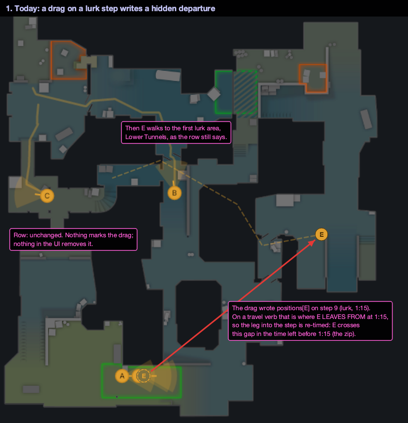
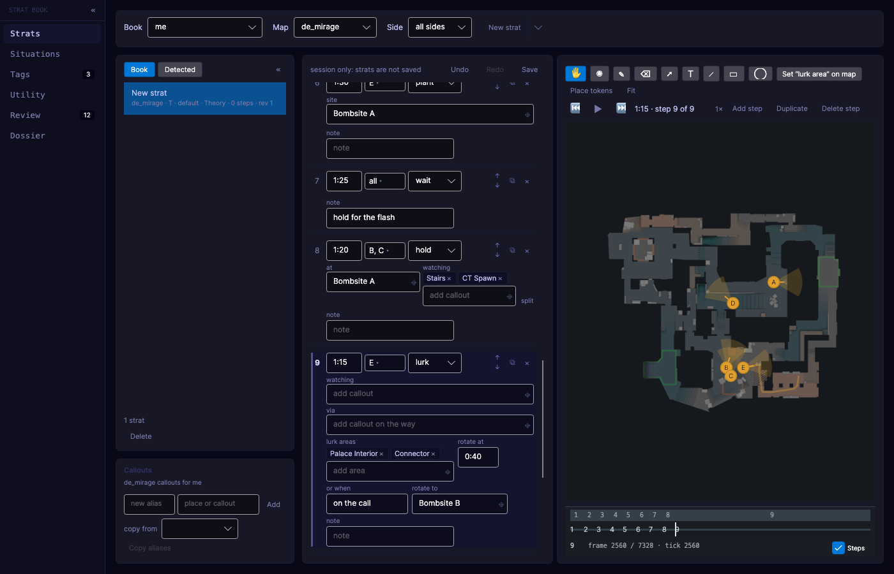
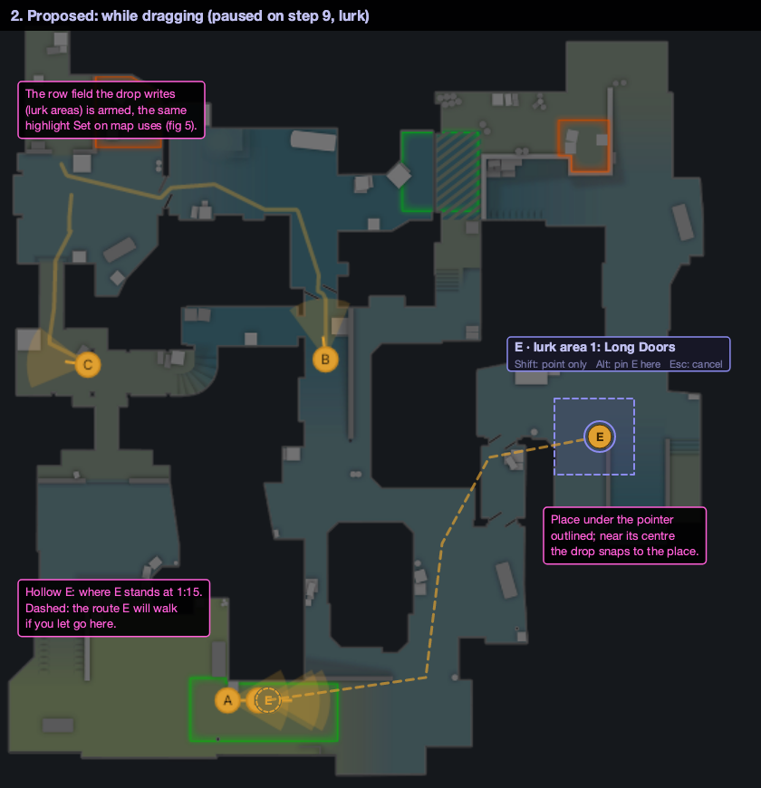
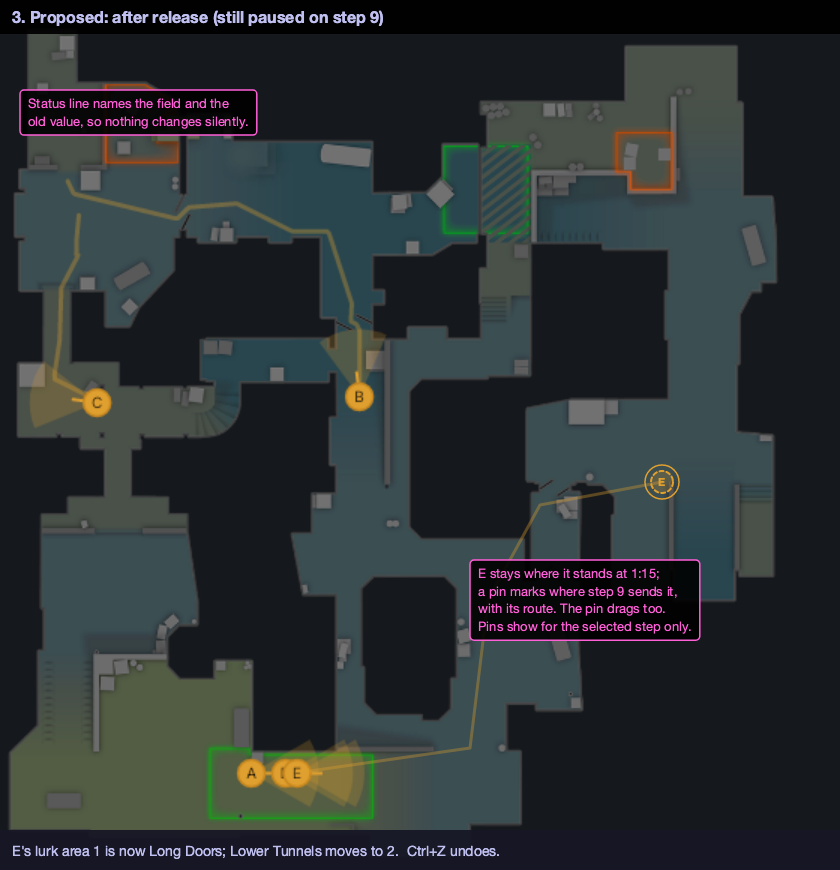
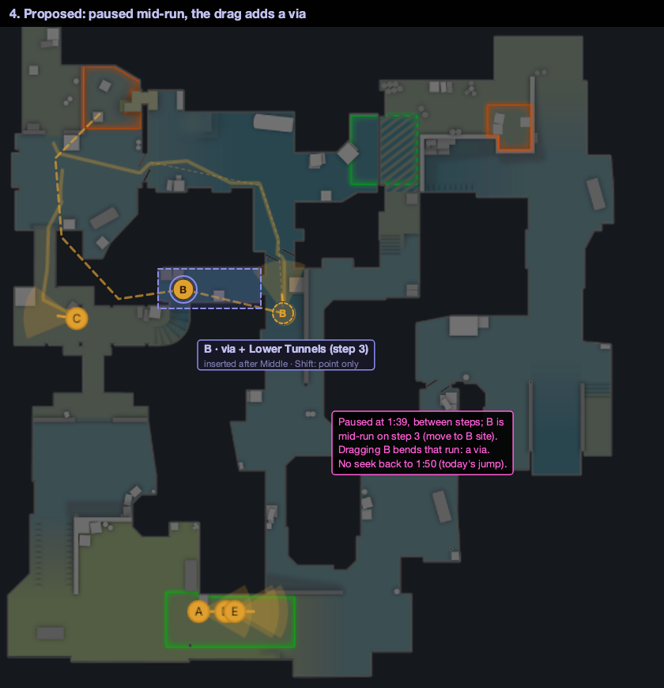
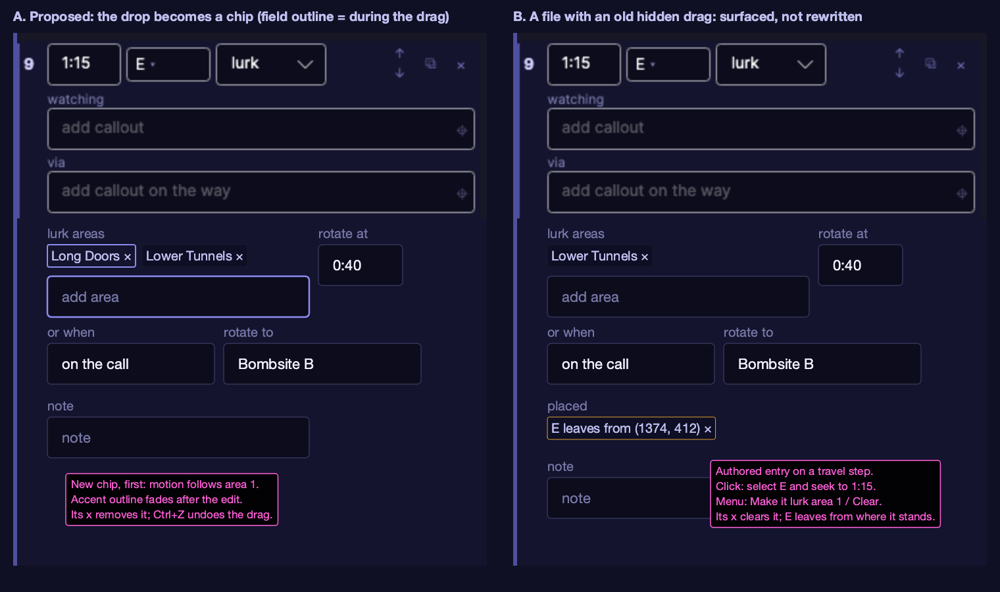

# Token drags on the strat canvas: what a drag writes

Owner request, 2026-10-01. In the strat editor the owner dragged E, on a lurk step, to Long Doors. E zipped across
the map in one second. The step's own fields (to, via, lurk areas) were still there, but the drag silently
overrode them. Nothing in the UI shows that a drag happened, and nothing removes it. The owner's words: "Simply
dragging should not invisibly override the step's definitions."

**Status:** decided 2026-10-01 (option A, the four recommended answers in section 9) and built on
`feature/strat-book-drag-fields`. "As built" at the end lists where the build differs from this text.

Images are in `docs/strat-book/drag-semantics/`:

* `current-*.png` are UiCapture renders of today's editor (`--theme dark --size 1400x900`).
* `fig*.png` are annotated mockups, drawn over those renders. A real render would need the code. Pink boxes are
  notes, not UI. Place positions on the dust2 map are approximate.

## 1. What happens today

The code paths: `StratCanvasViewModel.BeginDrag`, `EndDrag`, `StepAuthoringPatches.TokenPosition` and
`StratSceneProjection`.

* **Every drag goes to the selected step's tick.** `BeginDrag` pauses, seeks to the active step's tick and pins
  that step:
  * while playing, a press pauses and the playhead jumps to the step;
  * paused mid-transition, the playhead jumps back to the step.

  A drag never means "at the playhead".
* **It writes `positions[slot]`, marked as authored.** This clears `carried` and `observed`. Precedence puts an
  authored position above the step's destination:
  * on a position verb it is the spot, and `to` goes unused;
  * on a travel verb (move, push, rotate, other, lurk) it is where the token **leaves from** at the step's time.
* **The zip.** A departure is a keyframe with a fixed tick. Under the routing rule ("a segment whose ticks the steps
  fixed bends along its route and keeps both ticks"), the leg from the token's previous keyframe must reach that
  point by the step's time, so the drag re-times the leg before the step. E crossed to Long Doors in whatever time
  was left before 1:15, then walked on to its lurk area from there (fig 1).
* **Invisible.** No row field reads `positions[]`. The only ways to remove a drag are undo and deleting the step.
* **Cones.** On a verb that watches, a cone drag writes the line's `watch.yawDegrees`, which the row shows as the
  `135°` angle button, and that clears it. On any other verb it writes the position's yaw, which is hidden again.
* **`from` does not move anything.** The projection never reads a step's `from`; it is text for the call sheet.
* **Shift is taken.** `TokenTool.OnReleased` snaps the yaw to the drag direction when Shift is held on release.

Today's row for that lurk step (`strat-editor-who-lurk`) shows nothing of the drag:

## 2. The rule

**A drag is a Set on map pick on the field the row shows, with the drop point as the click.** It aims at the same
field `PlaceTargetFor` and `StratLocationField` already name, and it stores what a map click stores:

* a single field gets the place and the point, or the point alone outside every place;
* a multi field gets the place, or the point when the drop is in no place.

There is one addition: a drop near a place's centre snaps to the place alone (section 5).

The writers are the existing ones (`StratLocationPatches`, `StratLinePatches`, `StratLurkPatches`), so a drag is
one undo entry and the history reads it as a field edit. A drag never writes `positions[]` for A to E unless Alt is
held (section 5). Every result is a field value or a chip, and both already have a clear.

## 3. Paused and playing

| When the press lands | What the drag edits | Playhead |
|---|---|---|
| Paused on a step's tick | The selected step, by the verb table in section 4 | Stays |
| Paused between steps, and the token is mid-run | The run it is on: adds a **via** to that step, or to the token's line, at the leg the token is on (fig 4) | Stays (no seek) |
| Paused between steps, and the token is standing | The step that put it there (the latest step at or before the playhead whose destination or spot placed the slot), by the verb table | Stays |
| Playing | Pauses where it is at the press, then follows the paused rules above | Stays where paused |

* **The step that wins on the tick.** Under the same-tick rule (strat-format.md, "Several steps on one tick"), when
  steps share a tick, the one later in path order wins for a slot. So the drag aims at the step that wins for that
  slot at that tick, not blindly at the selected step. Otherwise the row would change while the canvas did not,
  which is the owner's complaint in reverse.
* **The drag selects the step it writes**, so that step's row scrolls into view and shows the change. The label
  names the step when it is not the selected one (`step 3 · B via + Lower Tunnels`).
* **Via insertion order.** A via place is inserted at the index of the leg the token was on, among the places. A
  point always goes at the end of `viaPoints`, since the format reads points after places (strat-format.md, "Via").
  The label says where it went (`inserted after Middle`).
* **Playing: pause, not refuse or record.**
  * Refusing makes the canvas feel broken while it plays.
  * Recording (writing keyframes while the clip runs) is a separate feature, with its own model of steps over time.
    Rejected here.
  * Pausing where it is, unlike today's pause and snap, keeps the moment the user grabbed.

## 4. What a drop writes, per verb

| Step verb | Token the step names | Writes | The row shows |
|---|---|---|---|
| move, push, rotate, other | the mover | its `to` (the line's `to` when the step has lines) | the `to` field |
| lurk | a lurker, before its rotate fires | **lurk area 1**: the drop is inserted first, and a place already in the list moves to first | a new first chip in lurk areas |
| lurk | a lurker on or after its rotate walk | `lurk.rotate.to` | the `rotate to` field |
| hold, peek, fake, plant, defuse | the player | its `at` / `site` (the line's `to`) | the place field |
| throw with a lineup | the thrower | nothing: refused, as today | status: "placed by its lineup: pick another lineup or clear it" |
| throw without a lineup, wait, call | the player | the step that put the token there, by this table | that step's row, selected |
| any | an own token the step does not name | see below | |
| any | an opponent, O1 to O5 | `positions[Ox]`, as today | an `opponents` chip (section 6) |

Each of these is also covered by the existing machinery:

* **Lines.** A step for everyone reads as one line per slot first, and a compact row of players who agree goes
  apart when one of them is dragged. Both are what the cone drag already does (`StratLinePatches`).
* **Lurk is shared.** A lurk lives on the step, so area 1 moves every lurker the step names. The label then names
  them all (`B, E · lurk area 1`). Two lurkers who split up are two steps, as the format already says.
* **Position verbs drop the slot's own entry.** On a position verb a position beats `to`, so a drag that writes
  `to` also removes the slot's authored or observed `positions[]` entry on that step, in the same undo entry. If it
  did not, the edit would not move the token. The history reads `E's placed position replaced`.
* **Unnamed own token.** The recommendation:
  * if the step's verb takes a `to`, the player **joins the step** as a line with the drop as their `to`: the
    `who` button gains the slot, and the line row appears;
  * on a lurk, throw, wait or call, the drag edits the step that last placed that player.

  Joining keeps the edit on the row the user is looking at. Editing an earlier step changes the canvas at earlier
  times, from a row that may be off screen. This is decision 3.
* **Lineup thrower.** It stays refused. A later step could snap the drag to that kind's lineup origins and switch
  the lineup on a drop. That is useful, but it is a new picker gesture and out of scope here.
* **Landing.** Set on map stays the way to set it. There is nothing to drag while the canvas is paused.

## 5. Feedback while dragging

* **Ghost.** A hollow token marks where the token stands at the playhead. The token itself follows the pointer.
* **Ghost route.** A dashed line runs from where the token leaves, through the step's vias, to the drop, routed
  live through `NavPathfinder` (7 to 74 us a query, cheap at pointer rate). Straight with routing off. It runs
  through **what will be stored**, not the pointer. A via or lurk area dropped inside a place stores the place, so
  the ghost bends through that place's arrival point; fig 4 simplifies this. With Shift, the point is stored and
  the ghost goes through the pointer.
* **Place under the pointer.** Outlined. Near the place's arrival centre (about 12 px on screen) the drop
  **snaps** to the place alone, with no point, so several tokens sent there fan out as usual. Elsewhere inside the
  place it stores the place and the point, as Set on map does.
* **Label beside the pointer.** It reads `<slot> · <field>: <value>`, in the row's own words (`to`, `at`, `site`,
  `via +`, `lurk area 1`, `pinned`), with the modifiers underneath.
* **The row field is armed.** It takes the same highlight a Set on map pick gives it (`ArmedField`), so the field
  that will change is lit before the release.
* **After release** (fig 3):
  * the token returns to where it stands at the step's time;
  * a **destination pin** (a hollow ring and a solid route) shows where the selected step sends each mover, and
    dragging a pin is the same edit as dragging its token;
  * each via on the selected step gets a small marker on the route;
  * after a mid-run via, the paused token is redrawn where the longer route puts it at that tick, which is not
    under the pointer;
  * the status line names the field and the old value (`E's to is now Long Doors (was Bombsite B). Ctrl+Z undoes`).

  Without the pin, the token springs back on release and the edit looks undone.

**Modifiers** (`ToolModifiers`; all three already reach the tool):

| Held | Effect |
|---|---|
| none | the field the verb table names; snaps to the place near its centre |
| Shift | point only: no place, no snap. **Replaces** today's Shift yaw snap, which the cone drag now covers |
| Alt (Option on macOS) | pin here: writes `positions[slot]` as today, shown as a `placed` chip (section 6). The deliberate escape hatch |
| Esc | cancels, as today |

* **Ctrl** stays free, kept for a possible "new step at the playhead" drag later.
* **Losing the Shift yaw snap is intended.** On the verbs that refuse cones (section 7), a token faces its run or
  keeps its last facing, and on those verbs that facing does not matter.
* **Alt on Linux.** GNOME and KDE take Alt+drag to move windows. Verify this on Linux and in the browser head. The
  fallback is a `Pin` toggle in the canvas toolbar that holds the Alt behaviour for the next drag.

**Theme.** These are code-drawn surfaces, so they resolve through `ThemeColors.Get`. Proposed new tokens, added to
both dictionaries:

* `Pb2dCanvasRouteGhostT` and `Pb2dCanvasRouteGhostCt` (the route at about 70% alpha);
* `Pb2dCanvasDropTarget` for the place outline and the label border.

`AccentInteractive` (#5050A0) is too dark over the radar; the mock uses a lighter violet. The label plate is
`CardBg` with `TextValue` and `TextMid`. Check contrast under high-contrast and light when it is built.

## 6. Hidden positions in the row

A **`placed`** pair sits in the step row above `note` and shows only when it has a chip. It is a `WrapPanel` of
`Border.placeChip` chips, so it wraps inside the 315 px editor that `StratEditorRoomTests` guards.

| Entry on the step | Chip | Border |
|---|---|---|
| authored A to E, travel verb | `E leaves from (1374, 412) ×` | `AccentCaution`: it re-times the leg before |
| authored A to E, any other verb | `E pinned at (1374, 412) ×`, and the row's `at` gets an info marker: "not used, E is pinned" | default |
| observed (a capture) | `E seen at (1374, 412) ×` | default |
| opponent | `O2 at (1374, 412) 135° ×` | default |
| carried | not shown: bookkeeping that never beats a field | |

**Volume.** The most common sources of `positions[]` are not drags:

* the round-start seed: ten spawn spots on a new strat's first step;
* captures and mining: an `observed` entry per player on every step.

A chip per entry would flood the 315 px row. So these rules apply:

* **One chip per entry** only when the entry overrides a field the row shows, or replaces it: a departure on a
  travel verb, a pin beside a non-empty `at`, or an observed entry on a step whose `to` disagrees with it.
* **Everything else is grouped**, one chip per kind and step, with a flyout listing the entries with their own `×`:
  `opponents (5)`, `seen (5)`, and `spots (5)` for authored spots with no field beside them.
* **The seed is not hidden state.** On a hold whose `at` is empty, the positions are the step's spots. They show
  as `spots (5)`, and dragging a seed token writes that player's `at` line and removes the entry, as on any
  position verb.

* **Text.** A point prints as its coordinate, through `StratLocations.Text`, the one formatter. The tooltip may name
  the place under it.
* **Clear.** `×`, or Delete or Backspace on a focused chip, removes the entry (one `remove` op, one undo entry).
  Clearing an observed chip changes how a captured strat plays; the history says so.
* **Click** selects the token and seeks to the step's time.
* **Context menu.**
  * *Make it the to* (or *lurk area 1*, *at*) moves the point into the field the verb table names (the place under
    it plus the point) and removes the entry: one entry.
  * *Clear* removes it.
* **Validator.** An info at `/steps/i/positions/j` for a departure on a travel verb. It becomes a warning when the
  leg it re-times is faster than a run (`E would cross 1900 u in 1.0 s`). That flags the zip itself.
* **Migration: none.** Files load and save byte for byte as before; nothing is rewritten on open. Old drags show as
  chips, and the owner converts or clears them one at a time.

## 7. Cones

| Verb | Cone drag | Visible as |
|---|---|---|
| push, hold, peek, fake, lurk (they watch) | the line's `watch.yawDegrees`, as today | the `135°` angle button, which clears it |
| move, rotate, other, throw, plant, defuse, wait, call | **refused**: "a runner faces its run; turn it on the hold or push after" | |
| an opponent | `positions[Ox].yawDegrees`, as today | the angle on its `opponents` chip |
| any token, paused mid-run | refused, same message | |

The hidden position yaw on non-watching verbs is the same defect class as the drag. Facing that matters already
lives on the verbs that watch.

## 8. Options

**A. The drag edits the fields (recommended).** Sections 2 to 7.

* *For:* the row always says what the canvas does. A drag is one more way to fill a field the user already
  understands, with the same clears and undo. No format change.
* *Against:* the most work of the three: target resolution by playhead state, the via leg index, pins and the
  ghost route, the chip strip. A precise departure point needs Alt.

**B. Keep today's write, make it visible.** The drag still writes `positions[]`, now shown in the `placed` chip
strip, with the zip warning and the destination pins.

* *For:* small and honest.
* *Against:* fails the request. The fields still disagree with the canvas, the owner's own drag would still zip,
  and the user has to learn that a drag means "leaves from".

**C. The departure becomes `from`.** A `from` with a point starts the run there, so a drag on a travel verb writes
`from`, a field the row already shows with `⌖` and `✕`.

* *For:* the override gets a real field.
* *Against:*
  * it serves the wrong intent: the owner meant "go here", not "start here";
  * it changes what `from` means;
  * captures and templates hold place-only `from`s, so only a pointed `from` may move tokens, which is a subtle rule;
  * it still re-times the leg before.

  It works best as the Alt behaviour inside A (decision 1).

## 9. Decisions (owner, 2026-10-01: all four as recommended)

1. **Departure overrides.** Decided: **Alt writes a `placed` chip.** Should "this travel starts from an exact point"
   survive? Pick one:
   * no: the departure is always where the token stands, and old ones are cleared from the chips;
   * Alt writes a `placed` chip (recommended);
   * Alt writes a `from` point that moves the token, option C.
2. **Lurk drag.** Decided: **insert first, keep the old areas.** Should a drop on a lurker insert the area first,
   keeping the old areas (recommended), or replace area 1?
3. **A token the step does not name.** Decided: **join the selected step as a line.** Should it join the selected
   step as a line (recommended), or should the drag edit the step that last placed that player?
4. **Paused mid-run.** Decided: **add a via to the run.** Should the drag add a via to the run (recommended), or
   insert a new step at the playhead with the drop as its `to`?

## Build notes (once decided)

App layer only. No protected parser file is touched.

* **The resolver.** A pure `StratDragTarget.Resolve(projection, tick, slot, modifiers)` returns a
  `StratLocationField` plus an insert mode. `BeginDrag` uses it in place of its seek.
* **The write.** `EndDrag` routes through `StratLocationPatches.Pick`. That needs a lurk insert-first mode and a via
  leg index.
* **The canvas.** The projection gains a per-step destination list for the pins and a route query for the ghost.
* **The row.** `StratStepRow` gains a `Placed` collection.
* **The design system.** `docs/ui/design-system.md` (map-first editing, step row, view cones) gets the decided
  version.

## As built

Where the build differs from the text above, or settles what it left open:

* **Selection.** The drag selects the step it writes only when that step owns the playhead's tick. Selecting a step on
  another tick moves the playhead, which decision 4 rules out. The label and the status line name that step instead
  (`step 2 · A · to: Hut`).
* **Shift's facing snap** is dropped, not moved. The cone drag on a verb that watches is the one way to set a facing.
* **Cones on `other`** are allowed: `other` uses every field, watching included, so its row shows a watching field and
  its angle button. Section 7's table listed it as refused.
* **A join** follows section 4: a verb with a `to` gains the player's line; on a lurk, throw, wait or call the drag
  edits the step that placed the player.
* **Mid-run without a via field.** A lurk's rotate walk takes `rotate to`; a position verb's walk takes its `at`. With
  routing off a run has no via ticks, so a via place goes after the step's other via places.
* **Points read after places.** A point dropped as a lurk area (Shift, or outside every place) goes after the place
  areas, not first; the format has no way to put it first. The same holds for via points.
* **Pins** show whenever the canvas is paused, for the selected step's runs that have not arrived, not only after a
  drag; they are hidden while dragging so the dashed ghost route reads on its own. Via marks are small diamonds in
  `Pb2dCanvasDropTarget`.
* **Guides are not part of the frame.** `SceneGuides` reaches `GuideLayer` from the host (`ISceneFrameHost.Guides`),
  and only a host with a token editor mounts the layer, so exports, fixtures, goldens and the 2D tab are unchanged.
  The label is an Avalonia overlay, not drawn in the scene.
* **Nothing places the token.** Paused on a token that no step has placed at or before the playhead, the drag is
  refused with "no step places E here to edit: hold Alt to pin it".
* **Opponents and Alt** write on the selected step (on its tick, the step that wins it for the slot).
* **The zip check** is a warning only, not an info on every departure. It reads the leg from the projection with the
  departure taken out (where the token last stood or arrived, by route length when routing is on), so it matches what
  the canvas plays. It runs as a session check the canvas supplies (`StratSession.GeometryChecks`), not in
  `StratValidator`, which has no map.
* **Seen positions.** A drop on a travel or lurk field also removes the slot's observed entry on the step (any entry in
  a legacy capture), since a capture's spot beats every field. The status line says so.
* **Step edits during a drag** cancel it first; a drag whose step moved under it writes nothing.
* **A drop the playhead has passed** (a lurker already at its last area when lurk area 1 changes) leaves a faint ring
  at the arrival of the step's first run for that token, until the playhead moves.
* **The pinned chip** says "not using the step's place" in its tooltip; the row's `at` gets no extra marker.
* **A group of one** reads as its entry (`O2 at (2060, 0) 135°`), not `opponents (1)`.
* **The armed highlight** is the existing one plus an `AccentInteractive` outline on the field's box, which Set on map
  now shows too.
* **The content end.** A drag that shortens the strat's content can clamp the paused playhead to the new end.
